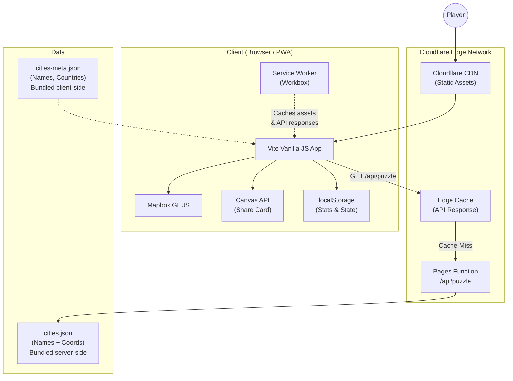
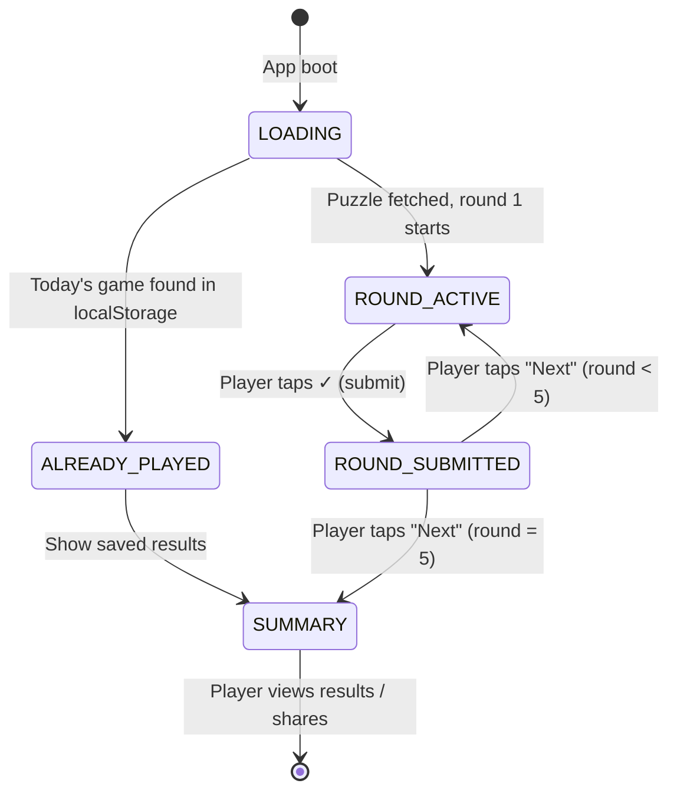
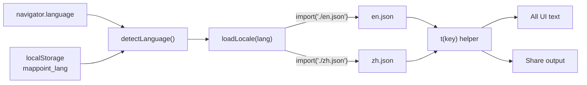

# MapPoint — Technical Implementation Plan

> **Purpose**: This document is a self-contained engineering specification for building MapPoint, a mobile-first daily geography guessing game. An engineering team should be able to implement the full Phase 1 product from this document alone.

---

## 1. Architecture Overview



### Key Architectural Decisions

| Decision | Choice | Rationale |
| :--- | :--- | :--- |
| **Hosting** | Cloudflare Pages + Pages Functions | Same-origin API (no CORS), free tier (unlimited static, 100k worker req/day), global CDN |
| **Map Provider** | Mapbox GL JS v3 | Best satellite imagery, custom styles for label hiding, 50k free map loads/month |
| **Build Tool** | Vite + vanilla JS | Zero framework runtime, modern DX (HMR, bundling, tree-shaking) |
| **PWA** | `vite-plugin-pwa` + Workbox | Install-to-homescreen, offline support after initial load, auto-update |
| **Puzzle Source** | Hybrid: client metadata + server coordinates | Fast city-name display, coordinates stay server-side for moderate anti-cheat |
| **Share Card** | Canvas API + Mapbox Static Images API | Consistent rendering, no `preserveDrawingBuffer` perf hit, zero backend |
| **QR Code** | `qr-creator` (~4.8 KB gzipped) | Smallest bundle, direct canvas output |
| **State Persistence** | `localStorage` | No user accounts in Phase 1; simple, instant, offline-compatible |
| **i18n** | Key-based JSON translation files, auto-detect from `navigator.language` | Zero-dependency, tiny bundle (~2–4 KB per locale), extensible to any language |

---

## 2. Technology Stack & Dependencies

### 2.1 Production Dependencies

| Package | Version | Size (min+gzip) | Purpose |
| :--- | :--- | :--- | :--- |
| `mapbox-gl` | ^3.x | ~290 KB JS + ~3 KB CSS | Interactive map with satellite tiles, borders, markers |
| `qr-creator` | ^1.x | ~4.8 KB | QR code generation for share card |
| `@turf/great-circle` | ^7.x | ~3 KB | Great-circle arc for animated result reveal line |

### 2.2 Dev Dependencies

| Package | Purpose |
| :--- | :--- |
| `vite` | Build tool, dev server, HMR |
| `vite-plugin-pwa` | PWA manifest & service worker generation |
| `wrangler` | Cloudflare Pages/Workers local dev & deployment CLI |

### 2.3 External Services

| Service | Usage | Free Tier |
| :--- | :--- | :--- |
| **Mapbox** | Map tiles (satellite + vector), Static Images API | 50k map loads/month, 50k static image requests/month |
| **Cloudflare Pages** | Static hosting + serverless API | Unlimited static bandwidth, 100k function requests/day |

### 2.4 Estimated Total Client Bundle Size

| Asset | Size (gzip) |
| :--- | :--- |
| Mapbox GL JS + CSS | ~293 KB |
| App JS (game logic, UI, sharing) | ~15–25 KB |
| `qr-creator` | ~4.8 KB |
| `@turf/great-circle` | ~3 KB |
| `cities-meta.json` (~1,000 entries, names only) | ~15–20 KB |
| CSS | ~5–8 KB |
| **Total (before map tiles)** | **~340–350 KB** |

> [!NOTE]
> Mapbox GL JS is the dominant bundle cost. It should be dynamically imported (`import('mapbox-gl')`) so the initial HTML/CSS shell renders instantly while the map SDK loads in parallel.

---

## 3. Project Structure

```text
MapPoint/
├── functions/                      # Cloudflare Pages Functions (serverless API)
│   └── api/
│       └── puzzle.ts               # GET /api/puzzle — returns today's 5 cities + coords
│
├── src/                            # Frontend source (processed by Vite)
│   ├── main.js                     # Entry point: bootstraps app, lazy-loads map
│   ├── game/
│   │   ├── state.js                # Game state machine (LOADING → ACTIVE → REVEAL → COMPLETE)
│   │   ├── scoring.js              # Haversine distance + scoring formula
│   │   └── puzzle.js               # Fetches daily puzzle, manages round progression
│   ├── map/
│   │   ├── mapManager.js           # Mapbox GL JS initialization, label stripping, view toggle
│   │   ├── marker.js               # Player pin placement & movement
│   │   └── revealAnimation.js      # Animated great-circle line from pin to target
│   ├── ui/
│   │   ├── screens.js              # Screen transitions (game, reveal, summary)
│   │   ├── header.js               # City prompt, round indicator, view toggle
│   │   ├── resultOverlay.js        # Distance, score, rating badge after each round
│   │   ├── summaryScreen.js        # End-of-game: total score, overview map, stats, sharing
│   │   └── countdown.js            # UTC midnight countdown timer
│   ├── share/
│   │   ├── emojiSummary.js         # Generates spoiler-free emoji text block
│   │   ├── shareCard.js            # Canvas API share card with QR code
│   │   └── shareManager.js         # Multi-tier sharing fallback (Web Share → clipboard → download)
│   ├── i18n/                       # Internationalization
│   │   ├── i18n.js                 # Core: language detection, loader, t() helper
│   │   ├── en.json                 # English UI strings
│   │   └── zh.json                 # Simplified Chinese UI strings
│   ├── storage/
│   │   └── localStorage.js         # Persistence: game state, stats, streaks, unit preference, language
│   ├── utils/
│   │   ├── haversine.js            # Great-circle distance calculation
│   │   ├── locale.js               # Auto-detect km/mi preference + language from browser locale
│   │   └── date.js                 # UTC date helpers, countdown calculations
│   └── styles/
│       ├── index.css               # Design system: CSS custom properties, reset, typography
│       ├── map.css                 # Map container, controls overlay
│       ├── game.css                # Game screens, transitions, animations
│       └── share.css               # Share card overlay, buttons
│
├── public/                         # Static assets (copied to build output as-is)
│   ├── index.html                  # Single-page app shell (lang="en" default, set dynamically)
│   ├── _routes.json                # Cloudflare routing: only /api/* hits Workers
│   ├── favicon.ico
│   ├── apple-touch-icon.png
│   └── icons/
│       ├── icon-192x192.png
│       └── icon-512x512.png
│
├── data/
│   ├── cities.json                 # FULL dataset with localized names + coords (~1,000 entries)
│   └── cities-meta.json            # CLIENT dataset with localized names, NO coordinates
│
├── scripts/
│   └── generate-meta.js            # Build script: strips coords from cities.json → cities-meta.json
│
├── wrangler.jsonc                  # Cloudflare Pages + Functions config
├── vite.config.js                  # Vite build config + PWA plugin
├── package.json
└── README.md
```

### 3.1 `_routes.json` (Cloudflare Routing)

Only requests to `/api/*` invoke the Workers function. All other requests serve static assets directly from CDN at zero cost:

```json
{
  "version": 1,
  "include": ["/api/*"],
  "exclude": ["/*"]
}
```

---

## 4. Data Model & City Dataset

### 4.1 City Data Schema

Each city entry in `data/cities.json` (the full server-side dataset) contains localized names keyed by language code:

```typescript
interface City {
  id: string;           // GeoNames geonameId as string, e.g. "1857910"
  names: {              // Localized city names
    en: string;         // English name, e.g. "Kyoto"
    zh: string;         // Chinese name, e.g. "京都"
    // Future languages added here: ja, es, fr, etc.
  };
  countries: {          // Localized country names
    en: string;         // e.g. "Japan"
    zh: string;         // e.g. "日本"
  };
  states?: {            // Localized state/province for disambiguation
    en: string;         // e.g. "Illinois"
    zh: string;         // e.g. "伊利诺伊州"
  };
  lat: number;          // Latitude in decimal degrees
  lng: number;          // Longitude in decimal degrees
}
```

Example entry:
```json
{
  "id": "1857910",
  "names": { "en": "Kyoto", "zh": "京都" },
  "countries": { "en": "Japan", "zh": "日本" },
  "lat": 35.0116,
  "lng": 135.7681
}
```

The client-side `data/cities-meta.json` has the same schema but **without `lat` and `lng` fields**. A build script (`scripts/generate-meta.js`) generates this automatically.

> [!TIP]
> GeoNames provides alternate names in many languages via its `alternateNames` export. The curation script should pull the `zh` alternate name for each city. Where a Chinese name is unavailable, fall back to the English name (most players will still recognize it).

### 4.2 City Prompt Display Logic

The city prompt uses the player's active language to look up localized names:

```javascript
function formatCityPrompt(city, lang) {
  const name = city.names[lang] || city.names.en;
  const country = city.countries[lang] || city.countries.en;
  const state = city.states?.[lang] || city.states?.en;
  return state ? `${name}, ${state}, ${country}` : `${name}, ${country}`;
}
```

- **English player**: *"Kyoto, Japan"*
- **Chinese player**: *"京都, 日本"*
- **With disambiguation**: *"Springfield, Illinois, USA"* / *"斯普林菲尔德, 伊利诺伊州, 美国"*

### 4.3 Dataset Curation Requirements

The engineering team must curate a dataset of **≥1,000 cities** following these guidelines:

| Criterion | Requirement |
| :--- | :--- |
| **Geographic spread** | All 6 inhabited continents represented proportionally to urbanization |
| **Population threshold** | Minimum ~100,000 population (capital cities exempt) |
| **Uniqueness** | Every `{name, state, country}` tuple must be unique **per language** |
| **Coordinate accuracy** | Lat/lng should target city center (town hall, central square, or geographic centroid) |
| **Source** | [GeoNames](https://www.geonames.org/) database recommended (free, CC-BY license, provides geoname IDs + alternate names in 100+ languages) |
| **Longevity** | 1,000 cities ÷ 5 per day = **200 unique days** before any repeat |
| **Localized names** | Every city must have both `en` and `zh` names. Use GeoNames `alternateNames` export. Fallback to English if Chinese name unavailable. |

### 4.4 Dataset Deduplication ID

> [!IMPORTANT]
> Use GeoNames `geonameId` (integer) as the canonical `id` field for each city. This guarantees global uniqueness and provides a stable reference for future features (Phase 2 leaderboards, custom lobbies). The `id` field in the JSON should be the string representation of the geonameId.

### 4.5 Build Script: `scripts/generate-meta.js`

```javascript
// Strips lat/lng from cities.json to produce cities-meta.json for client bundle
import { readFileSync, writeFileSync } from 'fs';

const cities = JSON.parse(readFileSync('data/cities.json', 'utf-8'));
const meta = cities.map(({ id, names, countries, states }) => {
  const entry = { id, names, countries };
  if (states) entry.states = states;
  return entry;
});

writeFileSync('data/cities-meta.json', JSON.stringify(meta));
console.log(`Generated cities-meta.json with ${meta.length} entries`);
```

This script should run as part of the build pipeline (see Section 11).

---

## 5. Backend — Cloudflare Pages Function

### 5.1 API Endpoint

**`GET /api/puzzle`**

Returns today's 5-city puzzle with target coordinates.

#### Request
No parameters required. The server uses the current UTC date to determine the puzzle.

#### Response (`200 OK`)

```json
{
  "date": "2026-07-31",
  "puzzleNumber": 42,
  "rounds": [
    { "id": "1850147", "lat": 35.6762, "lng": 139.6503 },
    { "id": "3451190", "lat": -22.9068, "lng": -43.1729 },
    { "id": "2643743", "lat": 51.5074, "lng": -0.1278 },
    { "id": "1275339", "lat": 19.0760, "lng": 72.8777 },
    { "id": "3871336", "lat": -33.4489, "lng": -70.6693 }
  ]
}
```

#### Response Headers (Edge Caching)
```
Content-Type: application/json
Cache-Control: public, max-age={secondsUntilUTCMidnight}, s-maxage={secondsUntilUTCMidnight}, must-revalidate
CDN-Cache-Control: max-age={secondsUntilUTCMidnight}
Vary: Accept-Encoding
```

> [!TIP]
> With `s-maxage` set to seconds-until-midnight, Cloudflare's edge CDN caches the response globally. After the first request per edge PoP per day, all subsequent requests are served from cache with **zero Worker CPU time**. This means ~100–300 Worker invocations per day globally (one per edge data center), well within the 100k/day free tier.

### 5.2 Daily Puzzle Selection Algorithm

The server picks 5 cities deterministically from the full dataset using the UTC date string as a seed:

```typescript
// functions/api/puzzle.ts
import citiesData from '../../data/cities.json';

interface City {
  id: string;
  name: string;
  country: string;
  state?: string;
  lat: number;
  lng: number;
}

const cities: City[] = citiesData as City[];

// Epoch date for puzzle numbering (set to launch date)
const EPOCH = new Date('2026-08-01T00:00:00Z');

/**
 * Seeded PRNG (mulberry32) for deterministic daily selection.
 * Returns a function that produces floats in [0, 1).
 */
function mulberry32(seed: number): () => number {
  return () => {
    seed |= 0;
    seed = (seed + 0x6d2b79f5) | 0;
    let t = Math.imul(seed ^ (seed >>> 15), 1 | seed);
    t = (t + Math.imul(t ^ (t >>> 7), 61 | t)) ^ t;
    return ((t ^ (t >>> 14)) >>> 0) / 4294967296;
  };
}

/**
 * Generates a numeric seed from a date string using DJB2 hash.
 */
function hashDateString(dateStr: string): number {
  let hash = 5381;
  for (let i = 0; i < dateStr.length; i++) {
    hash = ((hash << 5) + hash + dateStr.charCodeAt(i)) | 0;
  }
  return hash >>> 0;
}

/**
 * Fisher-Yates shuffle (partial) to pick `count` unique indices.
 */
function pickUnique(rng: () => number, total: number, count: number): number[] {
  const arr = Array.from({ length: total }, (_, i) => i);
  for (let i = 0; i < count; i++) {
    const j = i + Math.floor(rng() * (total - i));
    [arr[i], arr[j]] = [arr[j], arr[i]];
  }
  return arr.slice(0, count);
}

function getSecondsUntilUTCMidnight(): number {
  const now = new Date();
  const midnight = new Date(Date.UTC(
    now.getUTCFullYear(), now.getUTCMonth(), now.getUTCDate() + 1
  ));
  return Math.max(1, Math.floor((midnight.getTime() - now.getTime()) / 1000));
}

export const onRequestGet: PagesFunction = async () => {
  const now = new Date();
  const dateStr = now.toISOString().split('T')[0]; // "2026-07-31"
  const puzzleNumber = Math.floor(
    (now.getTime() - EPOCH.getTime()) / 86_400_000
  ) + 1;

  const seed = hashDateString(dateStr);
  const rng = mulberry32(seed);
  const indices = pickUnique(rng, cities.length, 5);

  const rounds = indices.map(idx => ({
    id: cities[idx].id,
    lat: cities[idx].lat,
    lng: cities[idx].lng,
  }));

  const ttl = getSecondsUntilUTCMidnight();

  return new Response(JSON.stringify({ date: dateStr, puzzleNumber, rounds }), {
    headers: {
      'Content-Type': 'application/json',
      'Cache-Control': `public, max-age=${ttl}, s-maxage=${ttl}, must-revalidate`,
      'CDN-Cache-Control': `max-age=${ttl}`,
      'Vary': 'Accept-Encoding',
    },
  });
};
```

> [!IMPORTANT]
> The PRNG must be deterministic and collision-free for the same date. **`mulberry32`** is recommended over simpler LCGs because it produces better distribution. The Fisher-Yates partial shuffle guarantees all 5 selected cities are unique.

### 5.3 Wrangler Configuration

```jsonc
// wrangler.jsonc
{
  "$schema": "node_modules/wrangler/config-schema.json",
  "name": "mappoint",
  "pages_build_output_dir": "./dist",
  "compatibility_date": "2024-09-23",
  "compatibility_flags": ["nodejs_compat"]
}
```

---

## 6. Frontend — Game Logic & UI

### 6.1 Game State Machine

The game progresses through a linear state machine. All state transitions are driven by user actions or API responses.



#### State Definitions

| State | Description | UI Shown |
| :--- | :--- | :--- |
| `LOADING` | Fetching puzzle from `/api/puzzle`, matching IDs to city metadata | Loading spinner overlay |
| `ROUND_ACTIVE` | Player sees city prompt, navigates map, places/moves pin | Map (full screen) + header (city name, round indicator) + ✓ submit button |
| `ROUND_SUBMITTED` | Animated reveal: line draws from pin to target, score displays | Map + result overlay (distance, score, badge) + "Next" button |
| `SUMMARY` | All 5 rounds complete | Summary screen: total score, overview map, stats, sharing buttons, countdown |
| `ALREADY_PLAYED` | Player returns after completing today's game | Jump directly to `SUMMARY` with saved results |

#### State Object Schema (in memory)

```javascript
const gameState = {
  status: 'LOADING',         // Current state machine status
  puzzleDate: '2026-07-31',  // UTC date string
  puzzleNumber: 42,          // Sequential day number
  currentRound: 0,           // 0-indexed (0–4)
  rounds: [                  // Populated after puzzle fetch
    {
      cityId: '1850147',
      cityName: 'Tokyo',
      country: 'Japan',
      state: null,
      targetLat: 35.6762,
      targetLng: 139.6503,
      guessLat: null,        // Set when player places pin
      guessLng: null,
      distanceKm: null,      // Calculated on submit
      score: null,            // Calculated on submit
      ratingBadge: null,      // 'spot-on' | 'excellent' | 'good' | 'fair' | 'miss'
    },
    // ... 4 more rounds
  ],
  totalScore: 0,
  totalDistanceKm: 0,
  unitPreference: 'km',      // 'km' or 'mi', auto-detected or from localStorage
};
```

### 6.2 Map Component (`src/map/mapManager.js`)

#### 6.2.1 Initialization

```javascript
export async function initMap(containerId) {
  const mapboxgl = await import('mapbox-gl');
  await import('mapbox-gl/dist/mapbox-gl.css');

  mapboxgl.accessToken = import.meta.env.VITE_MAPBOX_TOKEN;

  const map = new mapboxgl.Map({
    container: containerId,
    style: 'mapbox://styles/mapbox/satellite-streets-v12',
    center: [0, 20],        // Centered on Atlantic, showing most landmass
    zoom: 1.8,              // Shows full globe on mobile viewport
    minZoom: 1.5,
    maxZoom: 18,
    fadeDuration: 0,         // Crisp mobile tile rendering
    trackResize: true,
    attributionControl: false, // Custom placement for mobile
  });

  // Disable rotation & 3D tilt — North stays up
  map.dragRotate.disable();
  map.touchZoomRotate.disableRotation();
  map.touchPitch.disable();

  // Add compact attribution (required by Mapbox TOS)
  map.addControl(new mapboxgl.AttributionControl({ compact: true }), 'bottom-left');

  // Strip all text labels on style load
  map.on('style.load', () => {
    stripLabels(map);
  });

  return map;
}
```

#### 6.2.2 Label Stripping

```javascript
function stripLabels(map) {
  const style = map.getStyle();
  if (!style?.layers) return;

  style.layers.forEach((layer) => {
    if (layer.type === 'symbol') {
      map.setLayoutProperty(layer.id, 'visibility', 'none');
    }
  });
}
```

> [!NOTE]
> **Mapbox Studio alternative**: For production, creating a custom Mapbox Studio style with all `symbol` layers removed is recommended over runtime stripping. This avoids a brief flash of labels on initial load. The custom style ID is then used in the `style` option. Runtime stripping can serve as a fallback.

#### 6.2.3 View Toggle (Satellite ↔ Borders)

Two Mapbox Studio custom styles should be created:
1. **Satellite (no labels)**: Based on `satellite-streets-v12` with all symbol layers removed
2. **Borders (no labels)**: Based on `light-v11` with all symbol layers removed, retaining only `admin-0-boundary`, `admin-1-boundary`, coastlines, and water fill

```javascript
const STYLES = {
  satellite: 'mapbox://styles/{account}/mappoint-satellite-nolabel',
  borders: 'mapbox://styles/{account}/mappoint-borders-nolabel',
};

export function toggleMapView(map, currentView) {
  const nextView = currentView === 'satellite' ? 'borders' : 'satellite';
  map.setStyle(STYLES[nextView], { diff: true });
  return nextView;
}
```

> [!WARNING]
> `map.setStyle()` triggers a full style reload. The `{ diff: true }` option minimizes visual disruption, but **markers must be re-added after a style change**. Listen for the `style.load` event to restore markers and re-strip labels if using runtime stripping.

#### 6.2.4 Map Reset Between Rounds

Between rounds, reset the map to the initial global view:

```javascript
export function resetMapView(map) {
  map.flyTo({
    center: [0, 20],
    zoom: 1.8,
    duration: 800,
    essential: true,
  });
}
```

### 6.3 Pin Marker (`src/map/marker.js`)

```javascript
let playerMarker = null;
let selectedCoords = null;

export function setupPinHandler(map, onPinPlaced) {
  map.on('click', (e) => {
    const { lng, lat } = e.lngLat;
    selectedCoords = { lat, lng };

    if (!playerMarker) {
      playerMarker = new mapboxgl.Marker({
        color: '#FF3B30',
        draggable: true,
      })
        .setLngLat([lng, lat])
        .addTo(map);

      playerMarker.on('dragend', () => {
        const pos = playerMarker.getLngLat();
        selectedCoords = { lat: pos.lat, lng: pos.lng };
        onPinPlaced(selectedCoords);
      });
    } else {
      playerMarker.setLngLat([lng, lat]);
    }

    onPinPlaced(selectedCoords);
  });
}

export function removeMarker() {
  if (playerMarker) {
    playerMarker.remove();
    playerMarker = null;
    selectedCoords = null;
  }
}

export function getSelectedCoords() {
  return selectedCoords;
}
```

### 6.4 Result Reveal Animation (`src/map/revealAnimation.js`)

After the player submits, animate a great-circle arc from pin to target:

```javascript
import greatCircle from '@turf/great-circle';

export function animateRevealLine(map, pinCoords, targetCoords, durationMs = 1200) {
  const origin = [pinCoords.lng, pinCoords.lat];
  const destination = [targetCoords.lng, targetCoords.lat];

  // Compute great-circle arc with 100 interpolation points
  let arcCoords;
  try {
    const arc = greatCircle(origin, destination, { npoints: 100 });
    arcCoords = arc.geometry.coordinates;
  } catch {
    arcCoords = [origin, destination];
  }

  // Add target marker (green pin)
  const targetMarker = new mapboxgl.Marker({ color: '#10B981' })
    .setLngLat(destination)
    .addTo(map);

  // Clean up previous reveal line
  if (map.getLayer('reveal-line')) map.removeLayer('reveal-line');
  if (map.getSource('reveal-line')) map.removeSource('reveal-line');

  // Add animated line source
  map.addSource('reveal-line', {
    type: 'geojson',
    data: {
      type: 'Feature',
      geometry: { type: 'LineString', coordinates: [arcCoords[0]] },
    },
  });

  map.addLayer({
    id: 'reveal-line',
    type: 'line',
    source: 'reveal-line',
    paint: {
      'line-color': '#FF9500',
      'line-width': 3,
      'line-dasharray': [2, 1],
    },
    layout: { 'line-cap': 'round', 'line-join': 'round' },
  });

  // Fit map bounds to show both points
  const bounds = new mapboxgl.LngLatBounds();
  bounds.extend(origin);
  bounds.extend(destination);
  map.fitBounds(bounds, { padding: 80, duration: 600 });

  // Animate line drawing with ease-out
  return new Promise((resolve) => {
    const start = performance.now();
    function frame(now) {
      const progress = Math.min((now - start) / durationMs, 1);
      const eased = 1 - Math.pow(1 - progress, 3); // ease-out cubic
      const pointCount = Math.max(2, Math.floor(eased * arcCoords.length));

      map.getSource('reveal-line')?.setData({
        type: 'Feature',
        geometry: {
          type: 'LineString',
          coordinates: arcCoords.slice(0, pointCount),
        },
      });

      if (progress < 1) {
        requestAnimationFrame(frame);
      } else {
        resolve(targetMarker);
      }
    }
    requestAnimationFrame(frame);
  });
}
```

### 6.5 Scoring (`src/game/scoring.js`)

```javascript
/**
 * Haversine great-circle distance between two lat/lng points.
 * Returns distance in kilometers (or miles).
 */
export function haversineDistance(lat1, lon1, lat2, lon2, unit = 'km') {
  const R = unit === 'mi' ? 3958.8 : 6371.0;
  const toRad = (deg) => (deg * Math.PI) / 180;

  const dLat = toRad(lat2 - lat1);
  const dLon = toRad(lon2 - lon1);
  const a =
    Math.sin(dLat / 2) ** 2 +
    Math.cos(toRad(lat1)) * Math.cos(toRad(lat2)) * Math.sin(dLon / 2) ** 2;

  // Clamp to [0, 1] to avoid NaN from floating-point edge cases
  const c = 2 * Math.atan2(Math.sqrt(Math.min(1, a)), Math.sqrt(1 - Math.min(1, a)));
  return Math.round(R * c);
}

/**
 * Score formula: Points = max(0, round(5000 × e^(-distance_km / 1500)))
 */
export function calculateScore(distanceKm) {
  return Math.max(0, Math.round(5000 * Math.exp(-distanceKm / 1500)));
}

/**
 * Returns rating badge based on distance in km.
 */
export function getRatingBadge(distanceKm) {
  if (distanceKm < 50) return { label: distanceKm < 15 ? 'Spot On' : 'Excellent', emoji: '🟢', class: 'green' };
  if (distanceKm < 500) return { label: 'Good', emoji: '🟡', class: 'yellow' };
  if (distanceKm < 2000) return { label: 'Fair', emoji: '🟠', class: 'orange' };
  return { label: 'Miss', emoji: '🔴', class: 'red' };
}

/**
 * Converts km to miles.
 */
export function kmToMiles(km) {
  return Math.round(km * 0.621371);
}
```

### 6.6 Unit System Auto-Detection (`src/utils/locale.js`)

```javascript
// Countries that primarily use miles
const MILE_LOCALES = ['US', 'GB', 'MM', 'LR'];

export function detectUnitPreference() {
  // Check localStorage first (user may have manually toggled)
  const saved = localStorage.getItem('mappoint_unit');
  if (saved === 'km' || saved === 'mi') return saved;

  // Auto-detect from browser locale
  try {
    const locale = navigator.language || 'en-US';
    const regionCode = locale.split('-')[1]?.toUpperCase();
    if (regionCode && MILE_LOCALES.includes(regionCode)) return 'mi';
  } catch {}

  return 'km';
}

export function saveUnitPreference(unit) {
  localStorage.setItem('mappoint_unit', unit);
}
```

### 6.7 localStorage Persistence (`src/storage/localStorage.js`)

All game state and statistics are persisted in `localStorage` under namespaced keys:

```javascript
const KEYS = {
  GAME_STATE: 'mappoint_game',   // Today's in-progress/completed game
  STATS: 'mappoint_stats',       // Lifetime statistics
  UNIT: 'mappoint_unit',         // km or mi
};

/**
 * Saved game state shape (persisted after each round submission).
 */
export function saveGameState(state) {
  localStorage.setItem(KEYS.GAME_STATE, JSON.stringify({
    puzzleDate: state.puzzleDate,
    puzzleNumber: state.puzzleNumber,
    currentRound: state.currentRound,
    rounds: state.rounds,
    totalScore: state.totalScore,
    totalDistanceKm: state.totalDistanceKm,
    completed: state.status === 'SUMMARY',
  }));
}

export function loadGameState() {
  try {
    return JSON.parse(localStorage.getItem(KEYS.GAME_STATE));
  } catch {
    return null;
  }
}

/**
 * Lifetime statistics shape.
 */
const DEFAULT_STATS = {
  gamesPlayed: 0,
  currentStreak: 0,
  maxStreak: 0,
  totalDistanceKm: 0,
  totalRounds: 0,
  lastPlayedDate: null,
};

export function loadStats() {
  try {
    return { ...DEFAULT_STATS, ...JSON.parse(localStorage.getItem(KEYS.STATS)) };
  } catch {
    return { ...DEFAULT_STATS };
  }
}

export function updateStats(gameState) {
  const stats = loadStats();
  const today = gameState.puzzleDate;

  stats.gamesPlayed += 1;
  stats.totalRounds += 5;
  stats.totalDistanceKm += gameState.totalDistanceKm;

  // Streak logic: consecutive days
  if (stats.lastPlayedDate) {
    const lastDate = new Date(stats.lastPlayedDate + 'T00:00:00Z');
    const todayDate = new Date(today + 'T00:00:00Z');
    const dayDiff = (todayDate - lastDate) / 86_400_000;

    if (dayDiff === 1) {
      stats.currentStreak += 1;
    } else if (dayDiff > 1) {
      stats.currentStreak = 1;
    }
    // dayDiff === 0 means same day, don't change streak
  } else {
    stats.currentStreak = 1;
  }

  stats.maxStreak = Math.max(stats.maxStreak, stats.currentStreak);
  stats.lastPlayedDate = today;

  localStorage.setItem(KEYS.STATS, JSON.stringify(stats));
  return stats;
}
```

---

## 7. UI Screens & Layout

### 7.1 Mobile-First Layout Strategy

The game is designed for portrait-mode mobile devices (360px–430px width). Desktop is supported but secondary.

```
┌────────────────────────┐
│   HEADER BAR           │  ← Fixed top: city prompt, round dots, view toggle
│   (56px height)        │
├────────────────────────┤
│                        │
│                        │
│      MAP               │  ← Full remaining viewport (100vh - header - submit bar)
│      (Interactive)     │
│                        │
│                        │
├────────────────────────┤
│   SUBMIT BAR           │  ← Fixed bottom: ✓ icon button (48px)
│   (64px height)        │
└────────────────────────┘
```

### 7.2 Screen Inventory

#### Screen 1: Game Screen (Round Active)

| Element | Details |
| :--- | :--- |
| **Header** | City name ("Kyoto, Japan"), round dots (● ● ○ ○ ○), view toggle icon (🛰/🗺) |
| **Map** | Full-screen interactive Mapbox map, label-free |
| **Submit Button** | Floating action button (FAB) at bottom-center: checkmark icon (✓). Disabled until pin is placed. Pill-shaped, prominent. |
| **Settings Gear** | Small icon in header for km/mi toggle + language switcher |

#### Screen 2: Result Reveal (Round Submitted)

| Element | Details |
| :--- | :--- |
| **Map** | Zoomed to fit both pin and target, animated arc line drawn |
| **Result Card** | Slides up from bottom (bottom sheet pattern): distance ("142 km"), score ("4,550 pts"), color-coded badge (🟢 Excellent) |
| **Next Button** | At bottom of result card: "Next →" (rounds 1–4) or "See Results" (round 5) |

#### Screen 3: Summary Screen (Game Complete)

| Element | Details |
| :--- | :--- |
| **Total Score** | Large display: "21,450 / 25,000" |
| **Overview Map** | Mini map showing all 5 pin+target pairs with colored connecting lines |
| **Round Breakdown** | List of 5 rounds: city name, distance, score, emoji badge |
| **Stats Row** | Current streak 🔥, max streak, games played, avg distance |
| **Countdown** | "Next puzzle in: 05:23:17" (live UTC countdown) |
| **Share Section** | "Share Score" button (→ emoji text), "Share Card" button (→ canvas image), "Download Card" button |

### 7.3 CSS Architecture

Use CSS custom properties for a consistent design system:

```css
/* src/styles/index.css */
:root {
  /* Colors — Dark Theme */
  --bg-primary: #0f172a;
  --bg-secondary: #1e293b;
  --bg-card: #334155;
  --text-primary: #f8fafc;
  --text-secondary: #94a3b8;
  --text-muted: #64748b;
  --accent: #38bdf8;
  --accent-hover: #0ea5e9;

  /* Rating Colors */
  --green: #10b981;
  --yellow: #f59e0b;
  --orange: #f97316;
  --red: #ef4444;

  /* Spacing */
  --header-height: 56px;
  --submit-bar-height: 64px;
  --safe-area-bottom: env(safe-area-inset-bottom, 0px);

  /* Typography */
  --font-family: 'Inter', system-ui, -apple-system, sans-serif;
  --font-mono: 'JetBrains Mono', 'SF Mono', monospace;

  /* Transitions */
  --transition-fast: 150ms ease;
  --transition-normal: 300ms ease;
}

*, *::before, *::after {
  box-sizing: border-box;
  margin: 0;
  padding: 0;
}

html, body {
  height: 100%;
  overflow: hidden;                    /* Prevent scroll bounce on mobile */
  font-family: var(--font-family);
  background: var(--bg-primary);
  color: var(--text-primary);
  -webkit-font-smoothing: antialiased;
  -webkit-tap-highlight-color: transparent;
  user-select: none;
}
```

### 7.4 Typography

Load **Inter** from Google Fonts (400, 500, 700 weights) via a `<link>` tag with `font-display: swap` for fast first paint:

```html
<link rel="preconnect" href="https://fonts.googleapis.com">
<link rel="preconnect" href="https://fonts.gstatic.com" crossorigin>
<link href="https://fonts.googleapis.com/css2?family=Inter:wght@400;500;700&display=swap" rel="stylesheet">
```

### 7.5 Animations & Micro-Interactions

| Interaction | Animation |
| :--- | :--- |
| Pin placement | Scale-in bounce (`transform: scale(0) → scale(1.2) → scale(1)`, 300ms) |
| Submit button enable | Fade-in + subtle pulse glow |
| Result card reveal | Slide-up from bottom with spring easing (400ms) |
| Score counter | Animated count-up from 0 to final score (800ms) |
| Streak fire emoji | Gentle shake animation on display |
| View toggle | Map crossfade transition (handled by Mapbox) |
| Screen transitions | Fade/slide with 300ms duration |

### 7.6 Responsive Breakpoints

```css
/* Mobile (default) */
/* Styles written mobile-first */

/* Tablet (768px+) */
@media (min-width: 768px) {
  /* Center game in a max-width container */
  /* Summary screen: 2-column layout (map left, stats right) */
}

/* Desktop (1024px+) */
@media (min-width: 1024px) {
  .app-container {
    max-width: 480px;    /* Phone-width column, centered */
    margin: 0 auto;
    border-left: 1px solid var(--bg-card);
    border-right: 1px solid var(--bg-card);
  }
}
```

---

## 8. Sharing Features

Sharing defaults to the player's active language. A language selector in the share UI lets the player switch the share output language (e.g., a Chinese player may want to share in English to an international group).

### 8.1 Emoji Summary Text (`src/share/emojiSummary.js`)

```javascript
import { t } from '../i18n/i18n.js';

export function generateEmojiSummary(gameState, stats, shareLang = null) {
  // shareLang overrides the global language for this share output
  const lang = shareLang; // null means use active language via t()
  const badges = gameState.rounds.map(r => r.ratingBadge.emoji).join(' ');
  const totalDistDisplay = gameState.unitPreference === 'mi'
    ? `${kmToMiles(gameState.totalDistanceKm)} mi`
    : `${gameState.totalDistanceKm} km`;

  const scoreLabel = t('share.score', lang);       // "Score" / "得分"
  const offByLabel = t('share.offBy', lang);        // "Off by" / "偏差"
  const streakLabel = t('share.streak', lang);      // "Streak" / "连续"
  const daysLabel = t('share.days', lang);           // "Days" / "天"

  let text = `MapPoint #${gameState.puzzleNumber} 📍\n`;
  text += `${scoreLabel}: ${gameState.totalScore.toLocaleString()} / 25,000`;
  text += ` (${offByLabel}: ${totalDistDisplay})\n`;
  text += `${badges}\n`;

  if (stats.currentStreak > 1) {
    text += `🔥 ${streakLabel}: ${stats.currentStreak} ${daysLabel}\n`;
  }

  text += `https://mappoint.game`;  // Replace with actual domain
  return text;
}
```

### 8.2 Visual Share Card (`src/share/shareCard.js`)

Generate a 1200×630px (1.91:1 social media standard) canvas image:

1. **Background**: Dark gradient matching app theme
2. **Left side**: Static map snapshot via Mapbox Static Images API showing all 5 pin+target pairs
3. **Right side**: Game title, puzzle number, total score, round-by-round emoji badges
4. **Bottom-right corner**: QR code linking to `https://mappoint.game`

#### Mapbox Static Images API URL Construction

```javascript
function buildStaticMapUrl(rounds, mapboxToken) {
  // Build GeoJSON overlay with pins and targets
  const markers = rounds.flatMap((r, i) => [
    `pin-s+FF3B30(${r.guessLng},${r.guessLat})`,  // Red: player guess
    `pin-s+10B981(${r.targetLng},${r.targetLat})`, // Green: target
  ]).join(',');

  return `https://api.mapbox.com/styles/v1/mapbox/dark-v11/static/${markers}/auto/600x400@2x?access_token=${mapboxToken}&padding=40`;
}
```

> [!NOTE]
> The Static Images API has a URL length limit (~8,192 chars). For 5 rounds with 10 markers, the URL comfortably fits. The `auto` center/zoom parameter auto-fits all markers.

#### QR Code Rendering

```javascript
import QrCreator from 'qr-creator';

function drawQRCode(ctx, url, x, y, size) {
  // Create temporary canvas for QR
  const qrCanvas = document.createElement('canvas');
  QrCreator.render({
    text: url,
    radius: 0.3,
    ecLevel: 'M',
    fill: '#0f172a',
    background: '#ffffff',
    size: size,
  }, qrCanvas);

  // Draw white background rounded rect
  ctx.fillStyle = '#ffffff';
  ctx.beginPath();
  ctx.roundRect(x - 8, y - 8, size + 16, size + 16, 12);
  ctx.fill();

  // Draw QR code
  ctx.drawImage(qrCanvas, x, y, size, size);
}
```

### 8.3 Multi-Tier Share Fallback (`src/share/shareManager.js`)

The sharing system implements a cascading fallback chain optimized for mobile browsers:

| Priority | Method | Trigger |
| :--- | :--- | :--- |
| 1 | `navigator.share()` with image file | Modern mobile browsers (iOS Safari 15+, Android Chrome 75+) |
| 2 | `navigator.clipboard.write()` image | Desktop Chrome, supported mobile browsers |
| 3 | `navigator.share()` text only | Older mobile browsers |
| 4 | `navigator.clipboard.writeText()` | Desktop fallback |
| 5 | Direct PNG file download | Universal fallback |

> [!IMPORTANT]
> On iOS Safari, `navigator.clipboard.write()` with `ClipboardItem` **must** be called synchronously inside a user-gesture event handler (click/tap). The canvas-to-blob conversion is asynchronous, so the blob must be wrapped in a `Promise` passed to `ClipboardItem`: `new ClipboardItem({ 'image/png': canvas.toBlob(...) })`.

---

## 9. Internationalization (i18n)

### 9.1 Architecture Overview

The i18n system is a lightweight, zero-dependency, key-based translation layer. It is designed to:
- Ship only **one locale file at a time** (~2–4 KB each) — no loading unused languages
- Auto-detect language from the browser, with manual override
- Support localized city names, UI strings, and share output
- Be trivially extensible: adding a new language = adding one JSON file + localized city names



### 9.2 Supported Languages

| Code | Language | Status | Notes |
| :--- | :--- | :--- | :--- |
| `en` | English | Launch | Default fallback for all missing keys |
| `zh` | Simplified Chinese (zh-CN) | Launch | |
| `*` | Future languages | Extensible | Add `{lang}.json` + city name column |

### 9.3 Language Detection & Switching

```javascript
// src/i18n/i18n.js

const SUPPORTED_LANGS = ['en', 'zh'];
const DEFAULT_LANG = 'en';

let activeLang = DEFAULT_LANG;
let activeStrings = {};   // Currently loaded translation strings
let fallbackStrings = {}; // English strings (always loaded as fallback)

/**
 * Detects the best language from browser locale or saved preference.
 * Priority: localStorage > navigator.language > 'en'
 */
export function detectLanguage() {
  // 1. Check saved preference
  const saved = localStorage.getItem('mappoint_lang');
  if (saved && SUPPORTED_LANGS.includes(saved)) return saved;

  // 2. Check browser locale
  const browserLangs = navigator.languages || [navigator.language];
  for (const lang of browserLangs) {
    const code = lang.split('-')[0].toLowerCase(); // 'zh-CN' → 'zh'
    if (SUPPORTED_LANGS.includes(code)) return code;
  }

  return DEFAULT_LANG;
}

/**
 * Loads a locale's translation strings via dynamic import (code-split by Vite).
 */
export async function loadLocale(lang) {
  // Always load English as fallback
  if (!Object.keys(fallbackStrings).length) {
    fallbackStrings = (await import('./en.json')).default;
  }

  if (lang === 'en') {
    activeStrings = fallbackStrings;
  } else {
    try {
      activeStrings = (await import(`./${lang}.json`)).default;
    } catch {
      console.warn(`Locale '${lang}' not found, falling back to English`);
      activeStrings = fallbackStrings;
      lang = 'en';
    }
  }

  activeLang = lang;
  localStorage.setItem('mappoint_lang', lang);
  document.documentElement.lang = lang;
  return lang;
}

/**
 * Translation function. Retrieves a string by dot-notation key.
 * Falls back to English if the key is missing in the active locale.
 *
 * @param {string} key - Dot-notation key, e.g. "game.submit", "rating.excellent"
 * @param {string|null} overrideLang - Optional language override (for share output)
 * @returns {string} Translated string
 */
export function t(key, overrideLang = null) {
  const strings = overrideLang ? getStringsForLang(overrideLang) : activeStrings;
  return getNestedValue(strings, key) || getNestedValue(fallbackStrings, key) || key;
}

// Cache for override language strings (e.g., when sharing in a different language)
const langCache = {};
function getStringsForLang(lang) {
  return langCache[lang] || activeStrings;
}
// Called during loadLocale to populate cache
export function cacheLocaleStrings(lang, strings) {
  langCache[lang] = strings;
}

function getNestedValue(obj, path) {
  return path.split('.').reduce((o, k) => o?.[k], obj);
}

export function getActiveLang() { return activeLang; }
export function getSupportedLangs() { return [...SUPPORTED_LANGS]; }
```

### 9.4 Translation File Format

Translation files use flat-ish JSON with logical grouping. **English (`en.json`) is the canonical source of truth** — all keys must exist in English, other locales can omit keys to fall back.

#### `src/i18n/en.json`
```json
{
  "app": {
    "title": "MapPoint",
    "tagline": "Daily Geography Game"
  },
  "game": {
    "round": "Round",
    "submit": "Submit",
    "next": "Next",
    "seeResults": "See Results",
    "pinPrompt": "Tap the map to drop a pin"
  },
  "map": {
    "satellite": "Satellite",
    "borders": "Borders"
  },
  "result": {
    "distance": "Distance",
    "score": "Score",
    "points": "pts"
  },
  "rating": {
    "spotOn": "Spot On",
    "excellent": "Excellent",
    "good": "Good",
    "fair": "Fair",
    "miss": "Miss"
  },
  "summary": {
    "totalScore": "Total Score",
    "overview": "Overview",
    "stats": "Statistics",
    "gamesPlayed": "Games Played",
    "currentStreak": "Current Streak",
    "maxStreak": "Best Streak",
    "avgDistance": "Avg. Distance",
    "nextPuzzle": "Next puzzle in"
  },
  "share": {
    "shareScore": "Share Score",
    "shareCard": "Share Card",
    "downloadCard": "Download Card",
    "copied": "Copied!",
    "score": "Score",
    "offBy": "Off by",
    "streak": "Streak",
    "days": "Days"
  },
  "settings": {
    "title": "Settings",
    "units": "Distance Units",
    "language": "Language",
    "km": "Kilometers (km)",
    "mi": "Miles (mi)"
  },
  "offline": {
    "message": "You're offline. Connect to load today's puzzle."
  },
  "languages": {
    "en": "English",
    "zh": "中文"
  }
}
```

#### `src/i18n/zh.json`
```json
{
  "app": {
    "title": "MapPoint",
    "tagline": "每日地理挑战"
  },
  "game": {
    "round": "回合",
    "submit": "提交",
    "next": "下一题",
    "seeResults": "查看结果",
    "pinPrompt": "点击地图放置图钉"
  },
  "map": {
    "satellite": "卫星",
    "borders": "边界"
  },
  "result": {
    "distance": "距离",
    "score": "得分",
    "points": "分"
  },
  "rating": {
    "spotOn": "命中",
    "excellent": "优秀",
    "good": "不错",
    "fair": "一般",
    "miss": "偏离"
  },
  "summary": {
    "totalScore": "总分",
    "overview": "总览",
    "stats": "统计",
    "gamesPlayed": "游戏次数",
    "currentStreak": "当前连续",
    "maxStreak": "最佳连续",
    "avgDistance": "平均偏差",
    "nextPuzzle": "下一关倒计时"
  },
  "share": {
    "shareScore": "分享成绩",
    "shareCard": "分享卡片",
    "downloadCard": "下载卡片",
    "copied": "已复制！",
    "score": "得分",
    "offBy": "偏差",
    "streak": "连续",
    "days": "天"
  },
  "settings": {
    "title": "设置",
    "units": "距离单位",
    "language": "语言",
    "km": "公里 (km)",
    "mi": "英里 (mi)"
  },
  "offline": {
    "message": "您已离线，请连接网络以加载今日挑战。"
  },
  "languages": {
    "en": "English",
    "zh": "中文"
  }
}
```

### 9.5 Integration Points

Every UI component that renders text must use `t()` instead of hardcoded strings:

```javascript
// Before (hardcoded English)
submitBtn.textContent = 'Submit';
scoreLabel.textContent = `Score: ${score} pts`;

// After (i18n-aware)
import { t } from '../i18n/i18n.js';
submitBtn.textContent = t('game.submit');
scoreLabel.textContent = `${t('result.score')}: ${score} ${t('result.points')}`;
```

### 9.6 Language Switcher UI

A dropdown or segmented control in the settings panel:

```javascript
import { getSupportedLangs, getActiveLang, loadLocale, t } from '../i18n/i18n.js';

function renderLanguageSwitcher(container) {
  const langs = getSupportedLangs();
  const select = document.createElement('select');
  select.id = 'lang-switcher';
  select.setAttribute('aria-label', t('settings.language'));

  langs.forEach(code => {
    const opt = document.createElement('option');
    opt.value = code;
    opt.textContent = t(`languages.${code}`); // "English", "中文"
    opt.selected = code === getActiveLang();
    select.appendChild(opt);
  });

  select.addEventListener('change', async (e) => {
    await loadLocale(e.target.value);
    // Re-render all visible UI text
    refreshAllUIText();
  });

  container.appendChild(select);
}
```

> [!IMPORTANT]
> **After language switch, all visible text must update immediately.** The `refreshAllUIText()` function should re-call `t()` for every rendered text element. Since we use vanilla JS (no reactive framework), the simplest approach is to have each UI module export a `refresh()` function that re-reads `t()` values and updates the DOM.

### 9.7 Share Output Language

Share text and share card default to the player's active language. The share UI includes a small language toggle (e.g., "🌐 EN | 中文") allowing the player to switch the share output language independently of the app language.

```javascript
// In the share UI
let shareLang = getActiveLang(); // Default to player's language

// Language toggle buttons
langToggle.addEventListener('click', (e) => {
  shareLang = e.target.dataset.lang; // 'en' or 'zh'
  // Re-render preview of share text
  previewText.textContent = generateEmojiSummary(gameState, stats, shareLang);
});

// When share button is tapped
shareBtn.addEventListener('click', () => {
  const text = generateEmojiSummary(gameState, stats, shareLang);
  shareGameResults({ summaryText: text, canvas, dayNumber, lang: shareLang });
});
```

### 9.8 Share Card Localization

The Canvas share card also uses `t()` with the share language override:

```javascript
// In shareCard.js — text drawn on canvas uses the share language
ctx.fillText(t('share.score', shareLang) + `: ${totalScore.toLocaleString()} / 25,000`, x, y);
```

City names on the share card use the share language:
```javascript
const cityDisplay = city.names[shareLang] || city.names.en;
```

### 9.9 CJK Typography Considerations

Chinese text requires different font handling:

```css
:root {
  --font-family: 'Inter', system-ui, -apple-system, sans-serif;
  --font-family-cjk: 'PingFang SC', 'Microsoft YaHei', 'Noto Sans SC', sans-serif;
}

/* When lang="zh" is set on <html> */
:lang(zh) {
  font-family: var(--font-family-cjk);
  /* CJK text is denser — slightly increase line-height */
  line-height: 1.6;
}

/* Canvas share card should also use system CJK fonts */
```

> [!NOTE]
> **No CJK web font download needed.** `PingFang SC` is pre-installed on iOS/macOS, `Microsoft YaHei` on Windows, and `Noto Sans SC` on Android. Using system fonts keeps the bundle at zero extra bytes for Chinese support.

### 9.10 Adding a New Language (Developer Guide)

To add a new language (e.g., Spanish `es`):

1. **Create `src/i18n/es.json`** — copy `en.json`, translate all values
2. **Add `'es'` to `SUPPORTED_LANGS`** array in `src/i18n/i18n.js`
3. **Add `"es": "Español"` to the `languages` object** in all locale files
4. **Add Spanish city names** to `data/cities.json` under each city's `names.es` field
5. **Re-run `npm run build:meta`** to regenerate the client metadata
6. **Add CJK/special font stack** to CSS `:lang(es)` if needed (not required for Latin scripts)

No code changes are needed beyond these steps — Vite's dynamic `import()` automatically code-splits the new JSON file.

### 9.11 Bundle Size Impact

| Asset | Size (gzip) | Notes |
| :--- | :--- | :--- |
| `en.json` | ~0.5 KB | Only loaded for English users |
| `zh.json` | ~0.6 KB | Only loaded for Chinese users |
| `i18n.js` (runtime) | ~0.8 KB | Detection + loader + t() helper |
| City names (per language) | +~8 KB to `cities-meta.json` | ~8 extra bytes per city per language |
| **Total i18n overhead** | **~1.3–1.4 KB** per user | Only one locale loaded at a time |

> [!TIP]
> Because Vite dynamic imports split each `{lang}.json` into a separate chunk, a player **never downloads a language they don't use**. The i18n system adds negligible weight to the bundle.

---

## 10. PWA Configuration

### 9.1 Vite PWA Plugin (`vite.config.js`)

```javascript
import { defineConfig } from 'vite';
import { VitePWA } from 'vite-plugin-pwa';

export default defineConfig({
  plugins: [
    VitePWA({
      registerType: 'autoUpdate',
      injectRegister: 'auto',
      includeAssets: ['favicon.ico', 'apple-touch-icon.png', 'icons/*.png'],
      manifest: {
        name: 'MapPoint — Daily Geography Game',
        short_name: 'MapPoint',
        description: 'Guess cities on a label-free map. Daily challenge for geography lovers.',
        theme_color: '#0f172a',
        background_color: '#0f172a',
        display: 'standalone',
        orientation: 'portrait',
        scope: '/',
        start_url: '/',
        icons: [
          { src: 'icons/icon-192x192.png', sizes: '192x192', type: 'image/png' },
          { src: 'icons/icon-512x512.png', sizes: '512x512', type: 'image/png' },
          { src: 'icons/icon-512x512.png', sizes: '512x512', type: 'image/png', purpose: 'any maskable' },
        ],
      },
      workbox: {
        globPatterns: ['**/*.{js,css,html,ico,png,svg,woff2}'],
        runtimeCaching: [
          {
            // Mapbox tiles — cache-first, 30-day expiry
            urlPattern: /^https:\/\/api\.mapbox\.com\/.*/i,
            handler: 'CacheFirst',
            options: {
              cacheName: 'mapbox-tiles',
              expiration: { maxEntries: 500, maxAgeSeconds: 30 * 24 * 3600 },
              cacheableResponse: { statuses: [0, 200] },
            },
          },
          {
            // Daily puzzle API — network-first with 5s timeout, 24h cache
            urlPattern: /\/api\/puzzle/i,
            handler: 'NetworkFirst',
            options: {
              cacheName: 'daily-puzzle',
              networkTimeoutSeconds: 5,
              expiration: { maxEntries: 7, maxAgeSeconds: 24 * 3600 },
              cacheableResponse: { statuses: [0, 200] },
            },
          },
          {
            // Google Fonts stylesheets
            urlPattern: /^https:\/\/fonts\.googleapis\.com\/.*/i,
            handler: 'StaleWhileRevalidate',
            options: {
              cacheName: 'google-fonts-stylesheets',
              expiration: { maxEntries: 5, maxAgeSeconds: 365 * 24 * 3600 },
            },
          },
          {
            // Google Fonts webfont files
            urlPattern: /^https:\/\/fonts\.gstatic\.com\/.*/i,
            handler: 'CacheFirst',
            options: {
              cacheName: 'google-fonts-webfonts',
              expiration: { maxEntries: 20, maxAgeSeconds: 365 * 24 * 3600 },
              cacheableResponse: { statuses: [0, 200] },
            },
          },
        ],
      },
    }),
  ],
  build: {
    outDir: 'dist',
    sourcemap: false,
    rollupOptions: {
      output: {
        manualChunks: {
          mapbox: ['mapbox-gl'],  // Separate chunk for lazy loading
        },
      },
    },
  },
});
```

### 9.2 App Shell & Critical Rendering Path

The `index.html` should render the loading state (header + spinner) immediately with inlined critical CSS, before `mapbox-gl` loads:

```html
<!DOCTYPE html>
<html lang="en">
<head>
  <meta charset="UTF-8" />
  <meta name="viewport" content="width=device-width, initial-scale=1.0, viewport-fit=cover, user-scalable=no" />
  <meta name="theme-color" content="#0f172a" />
  <meta name="description" content="MapPoint — Daily geography game. Guess cities on a label-free map." />
  <title>MapPoint — Daily Geography Game</title>
  <link rel="manifest" href="/manifest.webmanifest" />
  <link rel="apple-touch-icon" href="/apple-touch-icon.png" />
  <link rel="preconnect" href="https://fonts.googleapis.com" />
  <link rel="preconnect" href="https://fonts.gstatic.com" crossorigin />
  <link href="https://fonts.googleapis.com/css2?family=Inter:wght@400;500;700&display=swap" rel="stylesheet" />

  <!-- Inline critical CSS for instant first paint -->
  <style>
    *, *::before, *::after { box-sizing: border-box; margin: 0; padding: 0; }
    html, body { height: 100%; overflow: hidden; background: #0f172a; color: #f8fafc; font-family: 'Inter', system-ui, sans-serif; }
    .loading-screen { display: flex; flex-direction: column; align-items: center; justify-content: center; height: 100%; gap: 16px; }
    .loading-screen h1 { font-size: 28px; font-weight: 700; }
    .spinner { width: 32px; height: 32px; border: 3px solid #334155; border-top-color: #38bdf8; border-radius: 50%; animation: spin 0.8s linear infinite; }
    @keyframes spin { to { transform: rotate(360deg); } }
  </style>
</head>
<body>
  <div id="app">
    <div class="loading-screen">
      <h1>📍 MapPoint</h1>
      <div class="spinner"></div>
    </div>
  </div>
  <script type="module" src="/src/main.js"></script>
</body>
</html>
```

### 9.3 Offline Behavior

| Scenario | Behavior |
| :--- | :--- |
| Player opens app, has cached today's puzzle | Works fully offline — puzzle served from service worker cache |
| Player opens app, no cached puzzle, offline | Shows "You're offline. Connect to load today's puzzle." message |
| Player in mid-game, loses connection | Game continues normally (all scoring is client-side) |
| Player completes game, offline | Results saved to localStorage, share features attempt clipboard/download fallbacks |

---

## 11. Environment Variables & Secrets

| Variable | Where Used | Storage |
| :--- | :--- | :--- |
| `VITE_MAPBOX_TOKEN` | Client-side map initialization & Static Images API | Vite `.env` file (public, expected — Mapbox tokens are URL-restricted) |
| `CLOUDFLARE_API_TOKEN` | CI/CD deployment only | GitHub Secrets / CI environment |
| `CLOUDFLARE_ACCOUNT_ID` | CI/CD deployment only | GitHub Secrets / CI environment |

> [!IMPORTANT]
> The Mapbox access token is necessarily exposed in client-side code. **Restrict the token** in the Mapbox dashboard to only allow requests from the production domain (`mappoint.game`) and `localhost` for development.

---

## 12. Build & Deployment Pipeline

### 11.1 `package.json` Scripts

```json
{
  "scripts": {
    "dev": "wrangler pages dev ./dist --live-reload",
    "build:meta": "node scripts/generate-meta.js",
    "build:vite": "vite build",
    "build": "npm run build:meta && npm run build:vite",
    "preview": "vite preview",
    "deploy": "npm run build && wrangler pages deploy ./dist --project-name=mappoint",
    "lint": "eslint src/ functions/"
  }
}
```

### 11.2 CI/CD (GitHub Actions)

```yaml
# .github/workflows/deploy.yml
name: Deploy MapPoint
on:
  push:
    branches: [main]

jobs:
  deploy:
    runs-on: ubuntu-latest
    steps:
      - uses: actions/checkout@v4
      - uses: actions/setup-node@v4
        with:
          node-version: 20
          cache: npm
      - run: npm ci
      - run: npm run build
      - name: Deploy to Cloudflare Pages
        uses: cloudflare/pages-action@v1
        with:
          apiToken: ${{ secrets.CLOUDFLARE_API_TOKEN }}
          accountId: ${{ secrets.CLOUDFLARE_ACCOUNT_ID }}
          projectName: mappoint
          directory: dist
```

### 11.3 Development Workflow

```bash
# Install dependencies
npm install

# Generate cities-meta.json (first time / after dataset changes)
npm run build:meta

# Start local dev server (Vite + Cloudflare Pages emulation)
npm run dev
# → Frontend: http://localhost:8788
# → API: http://localhost:8788/api/puzzle
```

---

## 13. Verification Plan

### 12.1 Automated Tests

| Test Category | Tool | What to Test |
| :--- | :--- | :--- |
| **Unit tests** | Vitest | Haversine distance (known city pairs), score calculation (boundary values), rating badges, PRNG determinism (same date → same cities), emoji summary format, streak logic |
| **API tests** | Wrangler `--test` / Vitest | `/api/puzzle` returns valid 5-city payload, cache headers set correctly, same response for same UTC day, different response on new day |
| **Build verification** | CI | `npm run build` succeeds, `cities-meta.json` has no coordinates, bundle size < 400KB (excluding map tiles) |

#### Key Unit Test Cases for Scoring

```javascript
// Boundary tests
assert(calculateScore(0) === 5000);       // Perfect
assert(calculateScore(15) === 4950);      // Spot On boundary
assert(calculateScore(1500) === 1839);    // Fair midpoint (e^-1 ≈ 0.368)
assert(calculateScore(50000) === 0);      // Very far

// Haversine known distances
// Tokyo (35.6762, 139.6503) to New York (40.7128, -74.0060) ≈ 10,838 km
assert(Math.abs(haversineDistance(35.6762, 139.6503, 40.7128, -74.006) - 10838) < 5);
```

### 12.2 Manual Verification Checklist

- [ ] **Mobile Safari (iOS)**: Full gameplay loop, pin placement, map gestures (no accidental rotation/tilt), share card generation, clipboard copy, install-to-homescreen PWA
- [ ] **Chrome Android**: Same as above + native `navigator.share()` with image file
- [ ] **Desktop Chrome**: Gameplay, keyboard/mouse interaction, share card download
- [ ] **Offline mode**: Complete game after loading, disconnect network, verify continued play
- [ ] **UTC midnight rollover**: Verify new puzzle appears after 00:00 UTC, yesterday's results persist in stats
- [ ] **Label stripping**: Verify NO city/place/road names visible in either satellite or borders view at all zoom levels
- [ ] **Performance**: First Contentful Paint < 1.5s on 4G mobile, map interactive < 3s

### 12.3 Performance Budget

| Metric | Target | Measurement |
| :--- | :--- | :--- |
| First Contentful Paint (FCP) | < 1.5s (4G mobile) | Lighthouse |
| Largest Contentful Paint (LCP) | < 2.5s (4G mobile) | Lighthouse |
| Total JS bundle (gzipped) | < 400 KB | Build output |
| Time to Interactive (TTI) | < 3.5s (4G mobile) | Lighthouse |
| Lighthouse Performance Score | ≥ 90 | Lighthouse |
| Lighthouse PWA Score | ≥ 90 | Lighthouse |

---

## 14. Deferred / Out of Scope for Phase 1

The following items from the game spec are explicitly **not** in scope for this implementation:

| Item | Status | Notes |
| :--- | :--- | :--- |
| Social media OAuth (Google, Apple, Twitter, Discord) | Phase 2 | Requires backend user sessions |
| Friends leaderboard | Phase 2 | Requires authenticated users + database |
| Custom lobbies / regional city pools | Phase 2 | Requires room management API + D1 database |
| Production domain (`[Game URL TBD]`) | Pending | Use `mappoint.pages.dev` until domain decided; update share text + QR code |
| City dataset curation | Parallel workstream | Engineering team needs ~1,000 curated cities before launch (see Section 4.3) |
