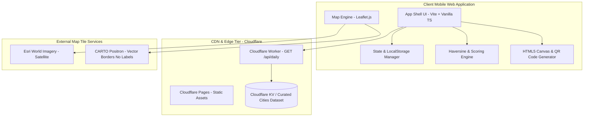

# 🌍 MapPoint — Technical Specification & Engineering Implementation Guide

> **Document Version**: 1.0.0  
> **Target Platform**: Mobile Web (PWA-ready) & Cloudflare Workers API  
> **Primary Objective**: Ultra-fast loading (< 100 KB total bundle, FCP < 500ms), mobile-first, daily geography guessing game.

---

## 📋 Table of Contents
1. [System Architecture Overview](#1-system-architecture-overview)
2. [Technology Stack](#2-technology-stack)
3. [Cloudflare Worker API Specification](#3-cloudflare-worker-api-specification)
4. [Frontend Architecture & Module Structure](#4-frontend-architecture--module-structure)
5. [Map Engine & Tile Layer Integration](#5-map-engine--tile-layer-integration)
6. [Mathematical Specifications & Scoring Engine](#6-mathematical-specifications--scoring-engine)
7. [State Management & LocalStorage Persistence](#7-state-management--localstorage-persistence)
8. [Social Sharing & HTML5 Canvas Card Generator](#8-social-sharing--html5-canvas-card-generator)
9. [Dataset Curation & Schema](#9-dataset-curation--schema)
10. [UI Design System & Mobile Layout Specs](#10-ui-design-system--mobile-layout-specs)
11. [Verification & Testing Plan](#11-verification--testing-plan)
12. [Internationalization (i18n) Architecture](#12-internationalization-i18n-architecture)

---

## 1. System Architecture Overview



- **Client**: Static SPA served via Cloudflare Pages or Vercel. 100% responsive, optimized for mobile touch targets.
- **Backend API**: Cloudflare Worker running at the edge. Computes and returns the current UTC day's 5 target cities.
- **Map Layer**: Leaflet.js consuming tile servers with strictly zero city/place text labels.

---

## 2. Technology Stack

| Layer | Technology Choice | Rationale / Budget |
| :--- | :--- | :--- |
| **Frontend Framework** | Vite + Vanilla TypeScript | Zero framework overhead. Sub-60KB JS bundle. Sub-500ms load time. |
| **Map Rendering** | Leaflet.js (v1.9.4) | Lightweight (~40 KB gzipped), excellent mobile touch gestures, simple API. |
| **Backend API** | Cloudflare Workers (TypeScript) | 0ms cold starts, global edge caching, zero maintenance. |
| **Satellite Tiles** | Esri World Imagery | High-resolution satellite tiles natively without text labels. Free usage. |
| **Border Map Tiles** | CARTO Positron (No Labels) | Clean, high-contrast vector-like map with country borders and zero labels. |
| **Sharing Engine** | HTML5 Offscreen Canvas + `qr-creator` | Zero-dependency client-side image generation + 2KB QR generator. |
| **Styles** | Native CSS Variables + Mobile Flexbox/Grid | No heavy CSS utility frameworks. Dark glassmorphism theme. |

---

## 3. Cloudflare Worker API Specification

### Endpoint: `GET /api/daily`

Returns the current 5 target cities for today's global puzzle based on **00:00 UTC**.

#### Request Headers
- `Accept: application/json`

#### Response `200 OK`
```json
{
  "gameId": 42,
  "utcDate": "2026-07-31",
  "resetTimestamp": 1785542400000,
  "cities": [
    {
      "round": 1,
      "id": "kyoto-jp",
      "displayName": "Kyoto, Japan",
      "lat": 35.0116,
      "lng": 135.7681
    },
    {
      "round": 2,
      "id": "springfield-il-us",
      "displayName": "Springfield, Illinois, USA",
      "lat": 39.7817,
      "lng": -89.6501
    },
    {
      "round": 3,
      "id": "reykjavik-is",
      "displayName": "Reykjavík, Iceland",
      "lat": 64.1466,
      "lng": -21.9426
    },
    {
      "round": 4,
      "id": "cape-town-za",
      "displayName": "Cape Town, South Africa",
      "lat": -33.9249,
      "lng": 18.4241
    },
    {
      "round": 5,
      "id": "perth-au",
      "displayName": "Perth, Australia",
      "lat": -31.9505,
      "lng": 115.8605
    }
  ]
}
```

#### Cloudflare Worker Implementation (`worker/index.ts`)
```typescript
interface Env {
  CITIES_KV: KVNamespace;
}

export default {
  async fetch(request: Request, env: Env): Promise<Response> {
    const url = new URL(request.url);
    
    if (url.pathname === '/api/daily') {
      const now = new Date();
      const utcDate = now.toISOString().split('T')[0]; // "YYYY-MM-DD"
      
      // Calculate start epoch for game index (e.g. Day 1 = 2026-06-19)
      const startDate = new Date('2026-06-19T00:00:00Z');
      const diffDays = Math.floor((now.getTime() - startDate.getTime()) / (1000 * 60 * 60 * 24));
      const gameId = Math.max(1, diffDays + 1);

      // Next reset timestamp (00:00 UTC tomorrow)
      const tomorrow = new Date(now);
      tomorrow.setUTCDate(tomorrow.getUTCDate() + 1);
      tomorrow.setUTCHours(0, 0, 0, 0);

      // Select 5 cities deterministically based on utcDate seed
      const cities = await getDailyCitiesForDate(utcDate, env);

      return new Response(JSON.stringify({
        gameId,
        utcDate,
        resetTimestamp: tomorrow.getTime(),
        cities
      }), {
        headers: {
          'Content-Type': 'application/json',
          'Access-Control-Allow-Origin': '*',
          'Cache-Control': 'public, max-age=300, s-maxage=3600'
        }
      });
    }

    return new Response('Not Found', { status: 404 });
  }
};
```

---

## 4. Frontend Architecture & Module Structure

```text
/Users/x/vibespace/MapPoint/
├── index.html
├── package.json
├── vite.config.ts
├── tsconfig.json
├── worker/
│   ├── index.ts
│   └── wrangler.toml
├── public/
│   ├── favicon.ico
│   ├── manifest.json
│   └── icons/
│       ├── icon-192.png
│       └── icon-512.png
└── src/
    ├── main.ts
    ├── styles/
    │   ├── variables.css
    │   ├── map.css
    │   └── ui.css
    ├── components/
    │   ├── MapManager.ts
    │   ├── Header.ts
    │   ├── CityPrompt.ts
    │   ├── Controls.ts
    │   ├── RoundResultModal.ts
    │   ├── GameSummaryModal.ts
    │   └── StatsModal.ts
    ├── services/
    │   ├── api.ts
    │   ├── gameState.ts
    │   └── storage.ts
    └── utils/
        ├── math.ts
        ├── shareCard.ts
        └── qr.ts
```

---

## 5. Map Engine & Tile Layer Integration

### 5.1 Leaflet Configuration (`src/components/MapManager.ts`)

```typescript
import L from 'leaflet';
import 'leaflet/dist/leaflet.css';

export class MapManager {
  private map: L.Map;
  private satelliteLayer: L.TileLayer;
  private borderLayer: L.TileLayer;
  private currentPinMarker: L.Marker | null = null;
  private resultPolyline: L.Polyline | null = null;
  private targetMarker: L.Marker | null = null;

  constructor(containerId: string, onPinPlaced: (lat: number, lng: number) => void) {
    this.map = L.map(containerId, {
      center: [20, 0],
      zoom: 2,
      minZoom: 2,
      maxZoom: 18,
      zoomControl: false,
      attributionControl: false
    });

    // Tile Layers
    this.satelliteLayer = L.tileLayer(
      'https://server.arcgisonline.com/ArcGIS/rest/services/World_Imagery/MapServer/tile/{z}/{y}/{x}',
      { maxZoom: 18, attribution: 'Esri' }
    );

    this.borderLayer = L.tileLayer(
      'https://{s}.basemaps.cartocdn.com/rastertiles/voyager_nolabels/{z}/{y}/{x}{r}.png',
      { maxZoom: 18, subdomains: 'abcd', attribution: 'CARTO' }
    );

    // Default to Satellite View
    this.satelliteLayer.addTo(this.map);

    // Handle pin drop tap
    this.map.on('click', (e: L.LeafletMouseEvent) => {
      const { lat, lng } = e.latlng;
      this.setPin(lat, lng);
      onPinPlaced(lat, lng);
    });
  }

  public setTileMode(mode: 'satellite' | 'borders') {
    if (mode === 'satellite') {
      this.map.removeLayer(this.borderLayer);
      this.satelliteLayer.addTo(this.map);
    } else {
      this.map.removeLayer(this.satelliteLayer);
      this.borderLayer.addTo(this.map);
    }
  }

  public setPin(lat: number, lng: number) {
    if (this.currentPinMarker) {
      this.currentPinMarker.setLatLng([lat, lng]);
    } else {
      const pinIcon = L.divIcon({
        className: 'user-pin-marker',
        html: `<div class="pin-pulse"></div><div class="pin-icon">📍</div>`,
        iconSize: [32, 32],
        iconAnchor: [16, 32]
      });
      this.currentPinMarker = L.marker([lat, lng], { icon: pinIcon }).addTo(this.map);
    }
  }

  public revealResult(targetLat: number, targetLng: number) {
    if (!this.currentPinMarker) return;
    const guessLatLng = this.currentPinMarker.getLatLng();

    // Add target marker
    const targetIcon = L.divIcon({
      className: 'target-pin-marker',
      html: `<div class="target-icon">🎯</div>`,
      iconSize: [32, 32],
      iconAnchor: [16, 16]
    });
    this.targetMarker = L.marker([targetLat, targetLng], { icon: targetIcon }).addTo(this.map);

    // Draw connecting line
    this.resultPolyline = L.polyline([guessLatLng, [targetLat, targetLng]], {
      color: '#3b82f6',
      weight: 3,
      dashArray: '8, 8',
      opacity: 0.8
    }).addTo(this.map);

    // Fit map bounds to frame both pins smoothly
    const bounds = L.latLngBounds([guessLatLng, [targetLat, targetLng]]);
    this.map.fitBounds(bounds, { padding: [80, 80], maxZoom: 8, animate: true, duration: 1 });
  }

  public resetRound() {
    if (this.currentPinMarker) {
      this.map.removeLayer(this.currentPinMarker);
      this.currentPinMarker = null;
    }
    if (this.targetMarker) {
      this.map.removeLayer(this.targetMarker);
      this.targetMarker = null;
    }
    if (this.resultPolyline) {
      this.map.removeLayer(this.resultPolyline);
      this.resultPolyline = null;
    }
    this.map.setView([20, 0], 2);
  }
}
```

---

## 6. Mathematical Specifications & Scoring Engine

### 6.1 Haversine Distance Formula (`src/utils/math.ts`)

```typescript
const EARTH_RADIUS_KM = 6371;
const KM_TO_MILES = 0.621371;

/**
 * Calculates geodesic distance between two points in km.
 */
export function calculateHaversineKm(lat1: number, lon1: number, lat2: number, lon2: number): number {
  const toRad = (angle: number) => (angle * Math.PI) / 180;
  
  const dLat = toRad(lat2 - lat1);
  const dLon = toRad(lon2 - lon1);

  const a =
    Math.sin(dLat / 2) * Math.sin(dLat / 2) +
    Math.cos(toRad(lat1)) * Math.cos(toRad(lat2)) *
    Math.sin(dLon / 2) * Math.sin(dLon / 2);

  const c = 2 * Math.atan2(Math.sqrt(a), Math.sqrt(1 - a));
  return EARTH_RADIUS_KM * c;
}

export function kmToMiles(km: number): number {
  return km * KM_TO_MILES;
}
```

### 6.2 Exponential Scoring & Rating Badges

$$\text{Points} = \max\left(0, \text{round}\left(5000 \times e^{-\frac{\text{Distance (km)}}{1500}}\right)\right)$$

```typescript
export function calculatePoints(distanceKm: number): number {
  if (distanceKm <= 0) return 5000;
  const rawScore = 5000 * Math.exp(-distanceKm / 1500);
  const points = Math.round(rawScore);
  return Math.max(0, Math.min(5000, points));
}

export interface RatingBadge {
  label: 'Spot On' | 'Excellent' | 'Good' | 'Fair' | 'Miss';
  emoji: '🟢' | '🟡' | '🟠' | '🔴';
  color: string;
}

export function getRatingBadge(distanceKm: number): RatingBadge {
  if (distanceKm < 50) {
    return { label: 'Spot On', emoji: '🟢', color: '#22c55e' };
  } else if (distanceKm < 500) {
    return { label: 'Good', emoji: '🟡', color: '#eab308' };
  } else if (distanceKm < 2000) {
    return { label: 'Fair', emoji: '🟠', color: '#f97316' };
  } else {
    return { label: 'Miss', emoji: '🔴', color: '#ef4444' };
  }
}
```

---

## 7. State Management & LocalStorage Persistence

### 7.1 Data Schema (`src/services/storage.ts`)

```typescript
export interface RoundResult {
  round: number;
  cityId: string;
  cityName: string;
  targetLat: number;
  targetLng: number;
  guessLat: number;
  guessLng: number;
  distanceKm: number;
  points: number;
  badgeEmoji: string;
}

export interface DailyGameState {
  gameId: number;
  utcDate: string;
  currentRound: number; // 1 to 5
  isCompleted: boolean;
  rounds: RoundResult[];
  totalScore: number;
}

export interface UserStats {
  playedGames: number;
  currentStreak: number;
  maxStreak: number;
  lastPlayedDate: string; // "YYYY-MM-DD"
  totalPoints: number;
  totalDistanceKm: number;
  unitPreference: 'km' | 'mi';
}
```

### 7.2 Streak Verification Logic
When a game is completed:
1. Check `lastPlayedDate`.
2. If `lastPlayedDate` is yesterday (`utcDate - 1 day`), `currentStreak += 1`.
3. If `lastPlayedDate` is today, streak remains unchanged.
4. If `lastPlayedDate` is older than yesterday, `currentStreak = 1`.
5. Update `maxStreak = Math.max(maxStreak, currentStreak)`.

---

## 8. Social Sharing & HTML5 Canvas Card Generator

### 8.1 Emoji Summary Generator (`src/utils/shareCard.ts`)

```typescript
export function generateEmojiShareText(
  gameId: number,
  totalScore: number,
  totalDistanceKm: number,
  rounds: RoundResult[],
  streak: number,
  unit: 'km' | 'mi'
): string {
  const distStr = unit === 'mi' 
    ? `${Math.round(kmToMiles(totalDistanceKm))} mi` 
    : `${Math.round(totalDistanceKm)} km`;

  const emojiRow = rounds.map(r => r.badgeEmoji).join(' ');

  return `MapPoint #${gameId} 📍
Score: ${totalScore.toLocaleString()} / 25,000 (Off by: ${distStr})
${emojiRow}
🔥 Streak: ${streak} Days
https://mappoint.game`;
}
```

### 8.2 HTML5 Canvas Share Card Generator (1200 x 630 px)

```typescript
export async function generateShareCardBlob(
  gameId: number,
  totalScore: number,
  rounds: RoundResult[],
  streak: number,
  gameUrl: string = 'https://mappoint.game'
): Promise<Blob> {
  const canvas = document.createElement('canvas');
  canvas.width = 1200;
  canvas.height = 630;
  const ctx = canvas.getContext('2d')!;

  // 1. Dark Gradient Background
  const gradient = ctx.createLinearGradient(0, 0, 1200, 630);
  gradient.addColorStop(0, '#0f172a');
  gradient.addColorStop(1, '#1e293b');
  ctx.fillStyle = gradient;
  ctx.fillRect(0, 0, 1200, 630);

  // 2. Header Title
  ctx.fillStyle = '#f8fafc';
  ctx.font = 'bold 48px Inter, sans-serif';
  ctx.fillText(`MapPoint #${gameId}`, 60, 90);

  // 3. Score Callout
  ctx.fillStyle = '#22c55e';
  ctx.font = 'bold 72px Inter, sans-serif';
  ctx.fillText(`${totalScore.toLocaleString()} / 25,000 pts`, 60, 180);

  // 4. Badges Row
  let xOffset = 60;
  rounds.forEach((r, idx) => {
    ctx.fillStyle = '#334155';
    ctx.beginPath();
    ctx.roundRect(xOffset, 240, 180, 100, 16);
    ctx.fill();

    ctx.fillStyle = '#94a3b8';
    ctx.font = '18px Inter, sans-serif';
    ctx.fillText(`ROUND ${idx + 1}`, xOffset + 20, 270);

    ctx.fillStyle = r.badgeEmoji === '🟢' ? '#22c55e' : r.badgeEmoji === '🟡' ? '#eab308' : '#ef4444';
    ctx.font = 'bold 24px Inter, sans-serif';
    ctx.fillText(`${r.points} pts`, xOffset + 20, 310);

    xOffset += 200;
  });

  // 5. Streak Callout
  ctx.fillStyle = '#f97316';
  ctx.font = 'bold 32px Inter, sans-serif';
  ctx.fillText(`🔥 ${streak} Day Streak`, 60, 420);

  // 6. Draw Embedded QR Code in bottom right
  const qrCanvas = document.createElement('canvas');
  // Render QR code onto qrCanvas using qr-creator / qrcode library
  // ctx.drawImage(qrCanvas, 900, 390, 200, 200);

  return new Promise((resolve) => {
    canvas.toBlob((blob) => resolve(blob!), 'image/png');
  });
}
```

---

## 9. Dataset Curation & Schema

### City JSON Schema (`worker/data/cities.json`)

```json
[
  {
    "id": "kyoto-jp",
    "name": "Kyoto",
    "country": "Japan",
    "state": null,
    "displayName": "Kyoto, Japan",
    "lat": 35.0116,
    "lng": 135.7681
  },
  {
    "id": "springfield-il-us",
    "name": "Springfield",
    "country": "USA",
    "state": "Illinois",
    "displayName": "Springfield, Illinois, USA",
    "lat": 39.7817,
    "lng": -89.6501
  }
]
```

#### Disambiguation Standard:
1. Primary format: `City, Country` (e.g. *"Kyoto, Japan"*).
2. If city name exists in multiple major regions, include State/Province: `City, State/Province, Country` (e.g. *"Springfield, Illinois, USA"* vs *"Springfield, Massachusetts, USA"*).

---

## 10. UI Design System & Mobile Layout Specs

### Mobile Target Requirements
- Viewport bounds: `height: 100dvh`, `width: 100vw`, `overflow: hidden`.
- Touch target minimum size: `48px x 48px`.

### UI Component Layout Breakdown

```text
┌──────────────────────────────────────────────────────────┐
│  🌍 MapPoint #42           ⏱️ 04:12:09 UTC      ⚙️  📊   │ <-- Header Bar
├──────────────────────────────────────────────────────────┤
│                                                          │
│     ┌──────────────────────────────────────────────┐     │
│     │  📍 Round 1/5: Kyoto, Japan                  │     │ <-- Floating City Banner
│     └──────────────────────────────────────────────┘     │
│                                                          │
│                                                          │
│                   INTERACTIVE MAP VIEW                   │
│                   (No City Text Labels)                  │
│                                                          │
│                           📍 [User Pin]                  │
│                                                          │
│     ┌──────────────────────────────────────────────┐     │
│     │  📡 Satellite   |   🗺️ Borders               │     │ <-- Layer Switch Pill
│     └──────────────────────────────────────────────┘     │
│                                                          │
├──────────────────────────────────────────────────────────┤
│                       [   ✓   ]                          │ <-- Submission Button
└──────────────────────────────────────────────────────────┘
```

---

## 11. Verification & Testing Plan

### Automated Unit Tests
1. **Haversine Distance**:
   - `calculateHaversineKm(51.5074, -0.1278, 48.8566, 2.3522)` ≈ `343.5 km` (London to Paris).
2. **Scoring Bounds**:
   - `0 km` -> `5,000 pts`
   - `1,500 km` -> `1,839 pts`
   - `5,000 km` -> `178 pts`
3. **UTC Reset**:
   - Verify countdown timer ticks accurately and triggers modal reset at 00:00:00 UTC.

### UX & Mobile Compatibility Checklist
- [ ] iOS Safari: Double-tap on submit button does NOT trigger page zoom.
- [ ] Mobile Chrome: `100dvh` prevents mobile address bar layout jump when pin is dropped.
- [ ] Touch accuracy: Tapping map anywhere drops/re-positions marker smoothly without lag.
- [ ] Share card: "Copy Image" works seamlessly on iOS Share sheet and Android Chrome.

---

## 12. Internationalization (i18n) Architecture

### 12.1 Supported Locales
- `en` — English (Default)
- `zh-CN` — Simplified Chinese (简体中文)
- `zh-TW` — Traditional Chinese (繁體中文)

### 12.2 Auto-Detection & Preference Storage
1. On initial app launch, detect browser locale via `navigator.language`:
   - Matches `zh-CN`, `zh-SG`, `zh-Hans` ➔ Set locale to `zh-CN`.
   - Matches `zh-TW`, `zh-HK`, `zh-Hant` ➔ Set locale to `zh-TW`.
   - All other locales ➔ Fall back to `en`.
2. Save locale preference in `localStorage`: `userStats.language = 'en' | 'zh-CN' | 'zh-TW'`.
3. Provide an instant toggle in the Settings modal (⚙️) allowing players to switch languages dynamically without re-fetching or reloading the page.

### 12.3 Multilingual City Dataset & API Response Schema

The Cloudflare Worker API returns city display names for all supported locales in the `names` dictionary, allowing 0-latency language switching client-side:

```json
{
  "round": 1,
  "id": "kyoto-jp",
  "names": {
    "en": "Kyoto, Japan",
    "zh-CN": "日本京都 (Kyoto, Japan)",
    "zh-TW": "日本京都 (Kyoto, Japan)"
  },
  "lat": 35.0116,
  "lng": 135.7681
}
```

> **Design Note**: Including the English name alongside Chinese (e.g. `日本京都 (Kyoto, Japan)`) prevents transliteration ambiguity while ensuring players across all regions recognize the target location.

### 12.4 Lightweight UI Translation Dictionary (`src/i18n/locales.ts`)

```typescript
export type Locale = 'en' | 'zh-CN' | 'zh-TW';

export const translations = {
  en: {
    round: 'Round',
    offBy: 'Off by',
    pts: 'pts',
    spotOn: 'Spot On',
    excellent: 'Excellent',
    good: 'Good',
    fair: 'Fair',
    miss: 'Miss',
    nextRound: 'Next Round',
    viewSummary: 'View Summary',
    streak: 'Streak',
    copyShareText: 'Copy Results Text',
    downloadCard: 'Download Share Card',
    resetTimer: 'Next City Sequence In'
  },
  'zh-CN': {
    round: '第',
    offBy: '距离偏差',
    pts: '分',
    spotOn: '完美精准',
    excellent: '优秀',
    good: '良好',
    fair: '一般',
    miss: '偏差较大',
    nextRound: '下一轮',
    viewSummary: '查看总结',
    streak: '连续打卡',
    copyShareText: '复制文字成绩',
    downloadCard: '保存图片战报',
    resetTimer: '距离明日关卡重置'
  },
  'zh-TW': {
    round: '第',
    offBy: '距離偏差',
    pts: '分',
    spotOn: '完美精準',
    excellent: '優秀',
    good: '良好',
    fair: '一般',
    miss: '偏差較大',
    nextRound: '下一輪',
    viewSummary: '查看總結',
    streak: '連續打卡',
    copyShareText: '複製文字成績',
    downloadCard: '儲存圖片戰報',
    resetTimer: '距離明日關卡重置'
  }
};
```

---
*End of Technical Specification.*

